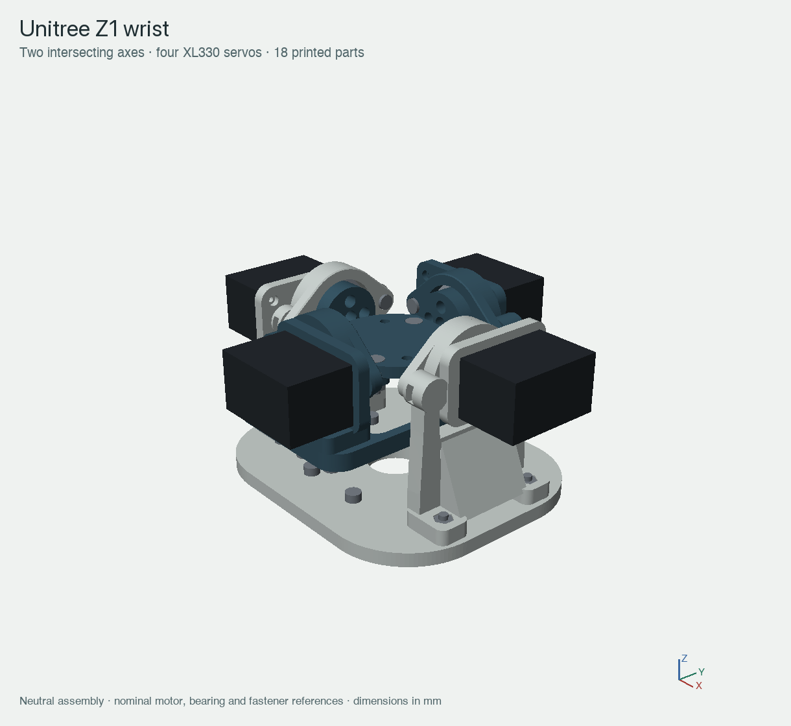
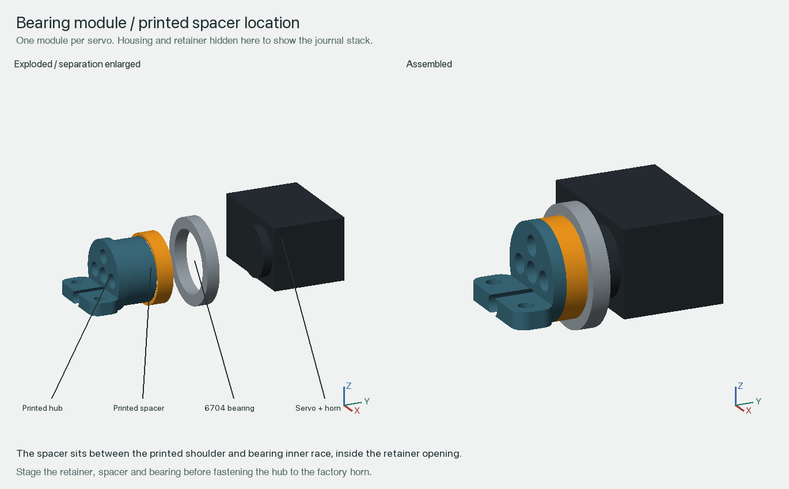

# Two-axis wrist assembly

This is a mechanical prototype with a recessed general-purpose output plate.
Four XL330-M288-T servos drive two intersecting axes, with two opposed servos per
axis. Each factory horn connects to its axis at 1:1; the servo's internal gearbox
remains intact. Physical fits, motor sharing, print strength and payload capacity
must be established on the assembled hardware.

The core contains **18 printed pieces, four servos and four bearings**. See
[BOM.csv](../BOM.csv) for the complete mechanical parts list. The selected M3
hardware is **32 screws and 24 plain nuts**. Motor connections add 16 M2×6 TAP
horn screws and 16 M2×8 TAP body screws; keep the original horns and their central
retaining screws.

## Coordinates and interfaces

All dimensions below are millimetres in the neutral assembly. The nominal arm
mounting face is Z=0. The common axis intersection and output-plate top are at
O=(0,0,50.5). The outer axis runs along X; the inner axis runs along Y and moves
with the outer gimbal. The core envelope is 128 ×120 ×67. Intended travel is
±25° outer and ±20° inner, subject to physical cable and clearance checks.

`18_output_plate` is 4 mm thick, with a 44 mm circular outline trimmed to 38 mm
across Y. Four countersunk attachment holes at X±8,Y±15 fasten it to the inner
hub shelves. Four additional Ø3.4 through-holes at X±14,Y±7 form a generic
28 ×14 mm output pattern. The plate centre stays at the common pivot; points
on an attached tool away from that centre move as the wrist rotates.

The nominal arm pattern is eight Ø3.4 clearance holes on a 59.5 mm bolt circle,
starting at 22.5° from +X and repeating every 45°. The 5 mm base and selected
M3×10 screws give 5 mm nominal thread entry. Confirm the actual flange pattern,
usable thread depth, connector protrusions and underside screw clearances before
mounting. Do not use the arm screws if they bottom out.

## Fastener locations

For ± coordinate pairs, use every indicated sign combination. Socket-screw
lengths are measured below the head; countersunk-screw length includes the head.

| Joint | Screws | Position and retention |
| --- | --- | --- |
| Four bearing retainers | 8 × M3×8 socket cap | Two per module, 37 mm apart tangentially, parallel to the servo axis; captive nuts in the closed bosses |
| Ground-support feet | 4 × M3×12 socket cap | X±45,Y±18.5; through the base from below into preloaded foot nuts |
| Inner-cassette feet | 4 × M3×12 socket cap | X±18.5,Y±41; through the gimbal from below into preloaded foot nuts |
| Gimbal half-laps | 4 × M3×10 socket cap | X±6,Y±42; screws from below, plain nuts above the 6 mm combined laps |
| Output plate to inner hubs | 4 × M3×12 countersunk | X±8,Y±15; 4 mm plate +4 mm shelf +2.4 mm nut; 1.6 mm nominal tip projection |
| Arm base | 8 × M3×10 socket cap | 59.5 mm bolt circle; screws from above into the arm, with no loose nuts |

At the neutral pose, all retainer screws lie at Z=50.5. Outer retainers have
axes along X at Y±18.5; inner retainers have axes along Y at X±18.5. The four
printed shim rings fit the driven journals, between their shoulders and the
bearing inner races. The retainers capture the bearing outer races; they must
not squeeze the rotating inner rings.

The nominal M3 socket heads are Ø5.5 ×3 high. Plain nuts are 5.5 across flats and
2.4 thick; captive pockets are 5.9 across flats and 2.8 deep. The DIN7991 output screws
use nominal Ø6 heads, 90° countersinks and 1.7 mm head height. Substituting head
styles, washers or thicker nuts changes the checked stacks.

## Ordered assembly

1. Deburr and fit-check the nut pockets, bearing seats, journals and mating
   faces. Identify left/right pieces in the assembly model. Keep the output
   plate off until the horn screws are accessible and fastened.
2. Preload two foot nuts and two retainer nuts into each empty support/cassette.
   Insert retainer nuts from the side; motors can obstruct later nut insertion.
3. Mount each servo with four M2×8 TAP body screws. Keep its factory horn and
   central retaining screw installed. Do not disturb the case-assembly screws.
4. Stage the retainer, shim ring and 6704 bearing on each free journal before
   attaching it to its horn. The shim seats against the journal shoulder and
   the bearing against the shim. Seat the bearing in the cassette, fasten the
   hub with four M2×6 TAP screws through the open inboard driver channels, then
   fit the two retainer screws. Do not force a bearing over a larger flange.
5. Build both inner hub/cassette modules and attach `18_output_plate` with four
   countersunk M3×12 screws and underside nuts. Heads must sit flush or below
   the plate. Build the two outer support/gimbal-half modules separately while
   their horn-driver paths remain exposed.
6. Bring the outer halves around the inner modules, align the cassette feet
   and close the half-laps. Install four lap screws and four inner-foot screws
   from below. Keep nut access open until every joint is seated.
7. Fit the base-to-arm screws while their top approaches are open, then attach
   the ground-support feet from below. Use a restrained fixture first if the
   actual arm obstructs access.
8. Check screw engagement, bearing seating, free rotation and cable routes
   with power removed. Configure unique servo IDs, directions and zero offsets
   before operating opposed pairs. Commission unloaded at low speed/current,
   checking for binding and unequal effort.

Follow the manufacturer's [XL330 assembly and electrical guidance](https://emanual.robotis.com/docs/en/dxl/x/xl330-m288/).
The horn connection uses a 3 mm printed stack with
[M2×6 TAP screws](https://emanual.robotis.com/assets/images/dxl/x/x330/x330_horn_screw.png).
Do not exceed the permitted horn penetration. The
[XL330 product specification](https://en.robotis.com/shop_en/item.php?it_id=902-0163-000)
lists M2×8 TAP frame screws. The servo supply is 3.7–6.0 V, with 5 V recommended;
never connect these servos directly to a 24 V tool supply.

## Printing and qualification

Orient the annular rings and output plate on suitable flat faces; choose support
and gimbal-half orientations that preserve their functional surfaces and load
paths. The STL files have starting orientations and sit at Z=0; they are not sliced print jobs. Retainers have their head recesses up, rings lie on a ring face, and the output plate has its countersinks up. Supports and frame halves start on their lower faces; the inner hubs have upright journals and require support review around their projecting shelves. Review
perimeters, supports, small nut lands and layer direction on the actual printer.
Use the nominal [6704 bearing dimensions](https://koyo.jtekt.co.jp/en/products/detail/?pno=6704)
(20 mm bore, 27 mm outer diameter, 4 mm width) as a starting interface, then fit
check the selected bearings and printed parts.

CAD validity and sampled clearance checks do not qualify material strength,
preload, creep, repeated loading, control stability or a working payload. Test
an unloaded restrained assembly before adding a tool or commissioning powered
loads. Cabling, power distribution and the control interface are separate from
the mechanical BOM.
